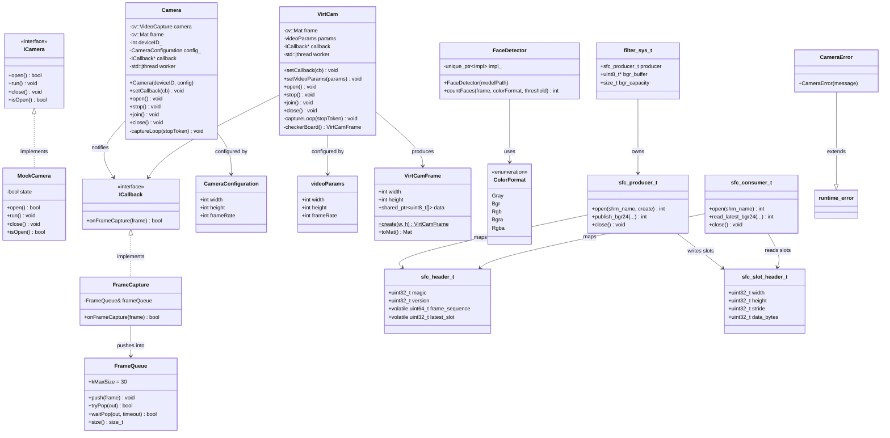
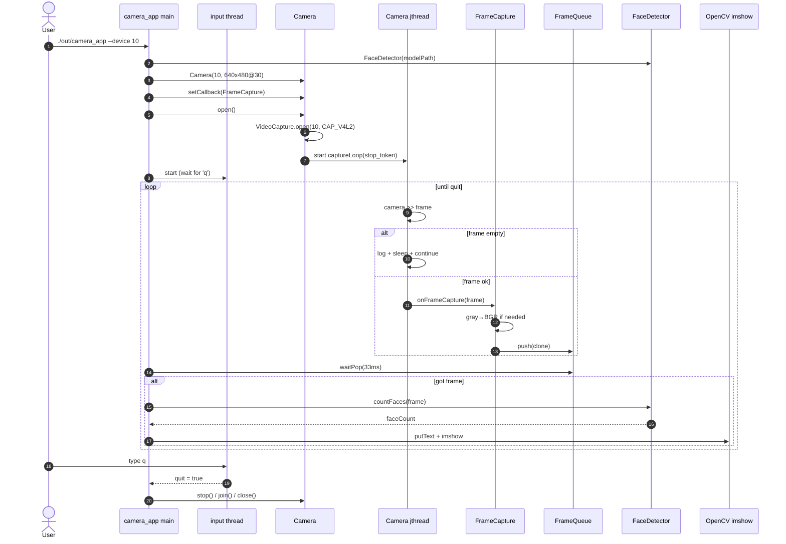
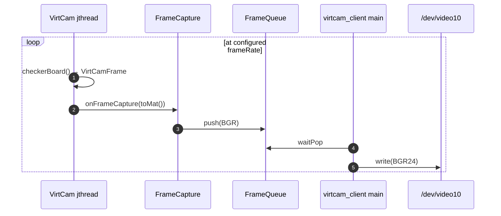
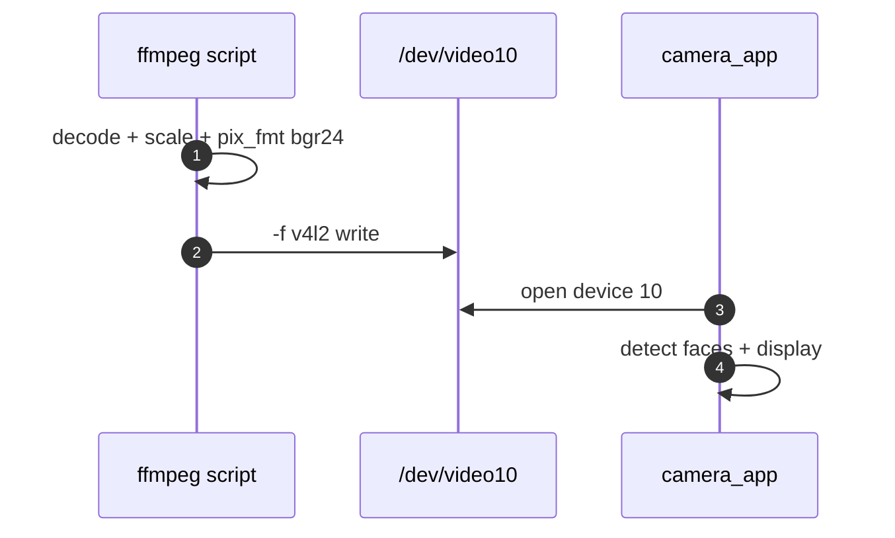

# camera_app Design Document

## 1. Overview

`camera_app` is a Linux C++ camera pipeline that:

1. Captures or synthesizes video frames
2. Optionally routes them through a virtual webcam (`v4l2loopback`, typically `/dev/video10`)
3. Displays frames in an OpenCV window
4. Optionally runs MediaPipe-style short-range face detection (TensorFlow Lite)

The system is designed so `camera_app` always looks like a normal V4L2 camera consumer. Producers (real webcam, checkerboard virtcam, VLC tap, or ffmpeg) feed frames into a device that OpenCV can open by index.

---

## 2. Goals and non-goals

### Goals

- Decouple frame production from UI/processing via callbacks and a thread-safe queue
- Support multiple video sources without changing `camera_app`
- Provide a VLC plugin path that taps decoded playback frames into the same loopback pipeline
- Optionally run on-device face counting with TFLite
- Keep capture on a background thread with cooperative stop (`std::jthread` + `stop_token`)

### Non-goals

- Full face landmarking / tracking UI (count + overlay only)
- Writing V4L2 devices from inside the VLC process
- Cross-platform support beyond Linux V4L2 / POSIX shm

---

## 3. System context

```text
┌──────────────────────┐     ┌─────────────────────┐     ┌──────────────────┐
│  Producers           │     │  Virtual webcam     │     │  Consumer        │
│                      │     │                     │     │                  │
│  • Real /dev/videoN  │────►│  /dev/video10       │────►│  camera_app      │
│  • virtcam_client    │     │  (v4l2loopback)     │     │   • FrameQueue   │
│  • VLC + frame_tap   │─┐   │                     │     │   • FaceDetector │
│  • ffmpeg script     │ │   └─────────────────────┘     │   • imshow       │
└──────────────────────┘ │                               └──────────────────┘
                         │
                         ▼
              POSIX shm (camera_app_vlc_frames)
                         │
                         ▼
              vlc_pipeline_client ──write──► /dev/video10
```

---

## 4. Components

| Component | Type | Responsibility |
|-----------|------|----------------|
| `camera_app` | Executable | Open V4L2 device, queue frames, detect faces, display |
| `camera_lib` (`Camera`) | Library | OpenCV V4L2 capture on a worker thread |
| `virtcam_lib` (`VirtCam`) | Library | Generate rate-limited checkerboard frames |
| `virtcam_client` | Executable | Push VirtCam frames to `/dev/video10` |
| `face_detector_lib` | Optional library | TFLite BlazeFace short-range face count |
| `shared_frame_channel_lib` | C library | Double-buffered BGR24 POSIX shared memory |
| `frame_tap` | Optional VLC plugin | Tap decoded VLC pictures → shm |
| `vlc_pipeline_client` | Executable | shm → resize → V4L2 loopback write |
| `feed_loopback_ffmpeg.sh` | Script | File decode → loopback (no VLC) |
| `unit_tests` | Executable | GoogleTest for MockCamera / VirtCam |

### Build options

| Option | Default | Effect |
|--------|---------|--------|
| `ENABLE_FACE_DETECTION` | ON | Builds FaceDetector if TFLite is found; defines `CAMERA_APP_WITH_FACE_DETECTION` |
| `ENABLE_VLC_PLUGIN` | OFF | Builds `libframe_tap_plugin.so` (needs `-DVLC_SOURCE_DIR`) |

---

## 5. Class diagram



### Design notes on the class model

- **`Camera` and `VirtCam` do not implement `ICamera`.** They share a similar lifecycle (`open` / `stop` / `join` / `close`) and both use `ICallback`, but `ICamera` is currently only implemented by `MockCamera` for tests.
- **`FrameCapture` is defined locally** in `camera_app_src/main.cpp` and again in `virtcam_client/main.cpp` (same shape, not a shared header type).
- **Shared-memory types are a C API** (`shared_frame_channel.h`) so both the VLC plugin (C) and C++ clients can link them.

---

## 6. Sequence diagrams

### 6.1 `camera_app` capture and display (with face detection)



### 6.2 VLC frame tap → shared memory → loopback → `camera_app`

```mermaid
sequenceDiagram
    autonumber
    participant VLC as VLC decoder
    participant Tap as frame_tap Filter
    participant SHM as POSIX shm<br/>camera_app_vlc_frames
    participant PC as vlc_pipeline_client
    participant LB as /dev/video10
    participant App as camera_app

    Note over PC,LB: Client opens loopback first;<br/>writes black frames while waiting for shm

    VLC->>Tap: picture_t (I420 / RGB24)
    Tap->>Tap: convert / copy → BGR24
    Tap->>SHM: sfc_producer_publish_bgr24
    Note over SHM: write slot pixels,<br/>set latest_slot,<br/>frame_sequence++
    Tap-->>VLC: return same picture_t (display continues)

    PC->>SHM: sfc_consumer_read_latest_bgr24
    alt new sequence
        SHM-->>PC: BGR frame + size
        PC->>PC: resize to 640x480 if needed
        PC->>LB: write(BGR24)
    else no new frame
        PC->>LB: write(black placeholder)
    end

    App->>LB: VideoCapture CAP_V4L2
    App->>App: FrameQueue → FaceDetector → imshow
```

### 6.3 VirtCam checkerboard → loopback



### 6.4 ffmpeg alternate path (no VLC)



---

## 7. Threading model

| Thread | Owner | Role |
|--------|-------|------|
| Capture `std::jthread` | `Camera` / `VirtCam` | Continuous `captureLoop`; stopped with `request_stop()` |
| Main consumer loop | each executable | Dequeue / shm poll, write or UI |
| Input quit `std::thread` | each main | Blocks on `cin`; sets `std::atomic<bool> quit` |
| VLC filter thread | VLC process | Calls `Filter()`; publishes to shm |

Synchronization:

- **`FrameQueue`:** mutex + condition variable; max 30 frames; oldest dropped on overflow
- **`Camera` / `VirtCam` lifecycle mutex:** protects config and worker start/stop
- **Shared memory:** lock-free latest-wins double buffer (`frame_sequence` + `latest_slot`)

---

## 8. Shared-memory design

Object name (default): `camera_app_vlc_frames` → `/dev/shm/camera_app_vlc_frames`

```text
┌─────────────────────────────────────────────┐
│ sfc_header_t                                │
│  magic, version, slot_count                 │
│  max_width/height, bytes_per_pixel          │
│  frame_sequence, latest_slot                │
├─────────────────────────────────────────────┤
│ slot 0: sfc_slot_header_t + BGR pixels      │
├─────────────────────────────────────────────┤
│ slot 1: sfc_slot_header_t + BGR pixels      │
└─────────────────────────────────────────────┘
```

Constraints: max **1920×1080**, **BGR24**, **2 slots**.

Producer (VLC plugin) writes a full slot then bumps `frame_sequence`.  
Consumer (`vlc_pipeline_client`) copies only when the sequence advances.

---

## 9. Data formats

| Stage | Format |
|-------|--------|
| VLC internal | Typically I420 / J420 / YV12, sometimes RGB24 |
| Shared memory / loopback write | BGR24 (`V4L2_PIX_FMT_BGR24`) |
| OpenCV `Camera` capture | `cv::Mat` (often BGR) |
| VirtCam internal | Grayscale checkerboard → converted to BGR by `FrameCapture` |
| FaceDetector input | Normalized 128×128 RGB-style tensor (from BGR by default) |

---

## 10. Error handling

- Open / format / inference failures throw or return **`CameraError`** (`std::runtime_error`).
- Empty V4L2 frames in `Camera::captureLoop` are logged periodically and retried (no throw from the worker thread).
- `vlc_pipeline_client` keeps the loopback “live” with black frames until shm appears, so `camera_app` can open the device early.
- Face detection is compile-optional; if TFLite is missing, CMake disables it rather than failing the whole build.

---

## 11. Runtime recipes

### Working path (ffmpeg)

```bash
sudo modprobe v4l2loopback video_nr=10
./scripts/feed_loopback_ffmpeg.sh /dev/video10 ./my_video.mp4   # terminal 1
./out/camera_app --device 10                                   # terminal 2
```

### Designed VLC path

```bash
sudo modprobe v4l2loopback video_nr=10
./out/vlc_pipeline_client --device /dev/video10
VLC_PLUGIN_PATH=$HOME/.local/share/vlc/plugins \
  vlc --video-filter=frame_tap ./my_video.mp4
./out/camera_app --device 10
```

### Checkerboard path

```bash
./out/virtcam_client          # writes /dev/video10
./out/camera_app --device 10
```

---

## 12. External dependencies

| Dependency | Purpose |
|------------|---------|
| OpenCV | Capture, Mat, resize, color convert, imshow |
| TensorFlow Lite (+ FlatBuffers) | Optional face detection |
| Linux V4L2 | Loopback OUTPUT write; capture via OpenCV `CAP_V4L2` |
| v4l2loopback | Kernel virtual webcam |
| VLC 3.0.x plugin headers | Optional `frame_tap` module |
| POSIX shm (`shm_open` / `mmap`, `librt`) | Cross-process frame bus |
| ffmpeg | Alternate file→loopback feeder |
| GoogleTest | Unit tests |
| C++20 threads | `jthread` / `stop_token` |

---

## 13. Known design caveats

1. **`ICamera` is not used by production apps** — only `MockCamera` implements it today.
2. **`vlc_pipeline_client` bypasses `FrameQueue` / `ICallback`** — it polls shm and writes V4L2 directly.
3. **Face detection runs on the main UI thread** after dequeue; a slow model can reduce display smoothness.
4. **Shared memory is latest-wins**, not a full frame queue — slow consumers may skip intermediate frames.
5. **Only one writer** should own `/dev/video10` at a time (ffmpeg vs `vlc_pipeline_client` vs `virtcam_client`).

---

## 14. Source map

| Path | Contents |
|------|----------|
| `common/camera.*` | V4L2 OpenCV capture |
| `common/virtcam.*` | Synthetic camera |
| `common/FaceDetector.*` | TFLite face count |
| `common/FrameQueue.h` | Thread-safe frame queue |
| `common/ICallBack.h` / `ICamera.h` | Interfaces |
| `common/shared_frame_channel.*` | POSIX shm transport |
| `camera_app_src/main.cpp` | Consumer app |
| `virtcam_client/main.cpp` | Checkerboard → loopback |
| `vlc_pipeline_client/main.cpp` | shm → loopback |
| `vlc_plugin/frame_tap.c` | VLC video filter |
| `scripts/feed_loopback_ffmpeg.sh` | ffmpeg feeder |
| `CMakeLists.txt` | Targets and feature flags |
